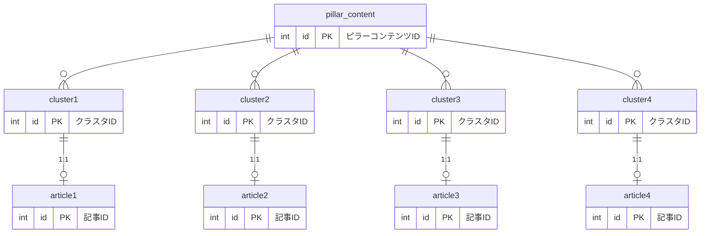

## DB設計 | トピッククラスター

### ER図

### 詳細定義
**pillar_content**
| name | type | null | key | default | description |
| ---- | ---- | ---- | ---- | ---- | ---- |
| id | int | × | PK | - | autoIncrement |
|  |  |  |  |  |  |
|  |  |  |  |  |  |
|  |  |  |  |  |  |
